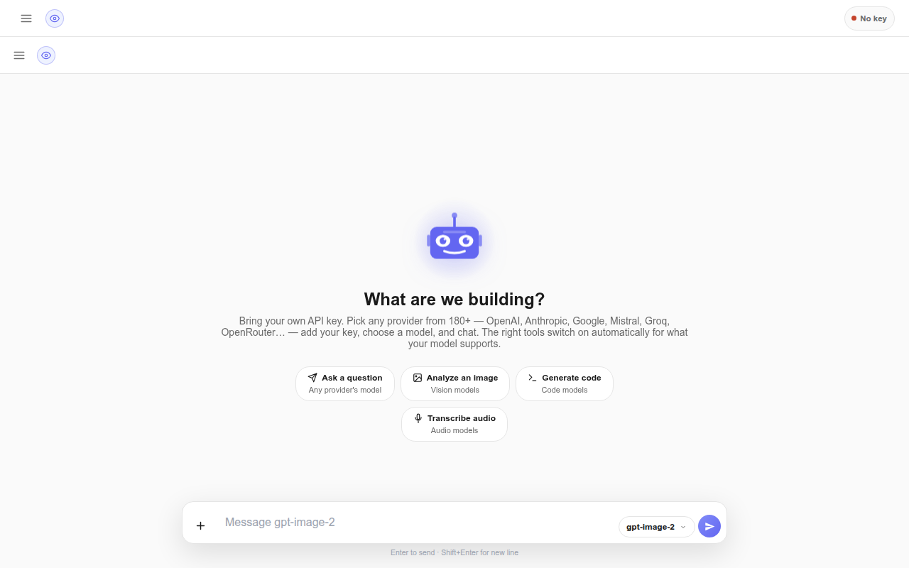
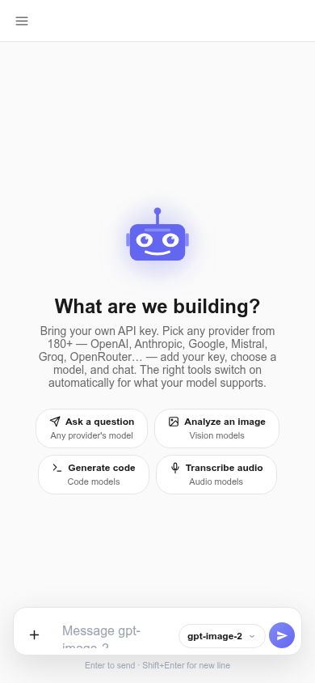
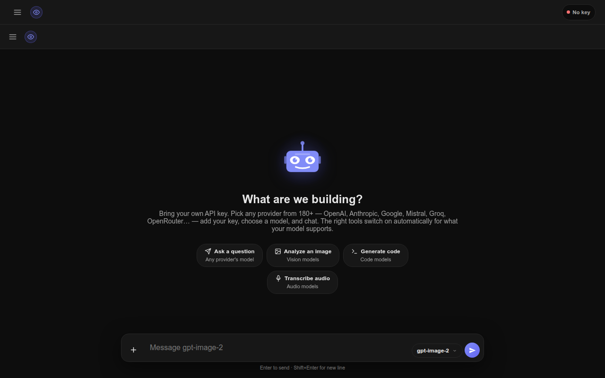

<div align="center">

# ⚡ anymodel

**One interface. 150+ AI providers. Your keys, your browser.**

[](https://abduljawad-ai.github.io/anymodel/)
[](https://github.com/abduljawad-ai/anymodel)
[]()
[]()

</div>

---

## 🖥️ It looks like this

<p align="center">
  
  <br>
  <em>Dark mode · chat with any model from any provider</em>
</p>

<p align="center">
  
  &nbsp;&nbsp;&nbsp;
  
  <br>
  <em>Mobile-first · light & dark themes</em>
</p>

---

## 💡 The pitch

Most AI chat apps want you to use **their** models.

anymodel goes the other way — it's a **BYOK (Bring Your Own API Key)** chat interface that puts every model you have access to behind one screen.

> You bring the keys. anymodel brings the interface.

- **No account. No backend. No lock-in.**
- Keys stay in your browser, sent only to the provider you pick.
- Everything runs client-side — zero servers, zero tracking.

---

## ✨ What it can do

| | |
|---|---|
| 🌐 **150+ providers** | Groq, OpenAI, Anthropic, Gemini, Ollama, custom endpoints, and more |
| 🧠 **Thousands of models** | A searchable catalog with 40+ capability tags — pick by *what it does*, not who made it |
| 🔑 **Bring your own key** | AES-256-GCM encrypted, stored only in your browser |
| ⚡ **Streaming chat** | Responses render live, with markdown + syntax-highlighted code |
| 👁️ **Vision & audio** | Send images, record voice, attach files — the app auto-picks a capable model |
| 🛠️ **Tools & intent routing** | Models call tools; a client-side fastText classifier auto-routes your message |
| 💬 **Persistent sessions** | Rename, switch, delete — history survives reloads |
| 📱 **Any screen** | Responsive from phone to desktop, dark & light themes |

---

## 🚀 Quick start

```bash
git clone https://github.com/abduljawad-ai/anymodel.git
cd anymodel
python3 -m http.server 8899
```

Open **http://localhost:8899/** → Settings → add your key → pick a model → chat.

That's it. No install, no build, no dependencies.

---

## 🔐 Privacy

```
Your key → your browser → your chosen provider
```

- API keys are **never** hardcoded, logged, or uploaded to any anymodel server.
- Keys are encrypted (AES-256-GCM) before touching `localStorage`.
- The only network traffic goes straight from your browser to the provider you chose.

> Your credentials belong to you. (Still, use providers you trust — your browser is part of the security boundary.)

---

## 🏗️ Architecture

Everything lives in the browser as ES modules — no framework, no build step.

```text
Browser
  ├── src/main.js          ← single entry point (ESM)
  │     ├── config/        constants · capabilities · demo tools
  │     ├── utils/         dom · icons · markdown · toasts
  │     ├── services/      catalog · api · intent · providers · storage
  │     ├── state/         AppState — pub/sub · persistence · encrypted keys
  │     └── components/    Chat · Composer · Header · ModelPicker · Settings ·
  │                        Sidebar · VoiceRecorder · VoiceCapsule · RobotAvatar
  │
  └── Provider API (OpenAI / Anthropic / Gemini / Groq / Ollama / compatible)
```

Models are treated as **data** — a provider catalog maps each model to its capabilities, so the UI never cares who made it.

---

## 🧩 Supported providers

OpenAI · Anthropic · Google Gemini · Groq · Ollama · OpenAI-compatible APIs · custom endpoints

*(The catalog grows without touching the chat interface.)*

---

## 🧭 What's next

- Better model discovery & comparisons
- More providers, more tools
- Smarter routing & context handling

---

<div align="center">

### Built for people who want **one interface for many models**.

[🚀 Live Demo](https://abduljawad-ai.github.io/anymodel/) · [📦 Repository](https://github.com/abduljawad-ai/anymodel)

</div>